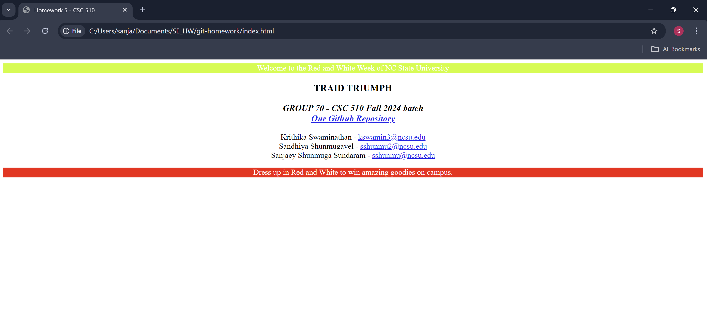

   
(#)

# Triad Triumph

[CSC 510 - Software Engineering 2024](https://txt.github.io/se24fall/index.html)  
We are a group of 3 whose names start with S - Success. Hence, Triad Triumph - just like the alliteration in our names.

# Git Homework

This repository is for completing the homework assignment that demonstrates proficiency with basic Git operations. The project includes initializing a Git repository, making commits, creating branches, resolving conflicts, and managing changes with `git stash`.

## Screenshot

## Moto

Learning . Unlearning . Unleasing

## Contributors

  
  

